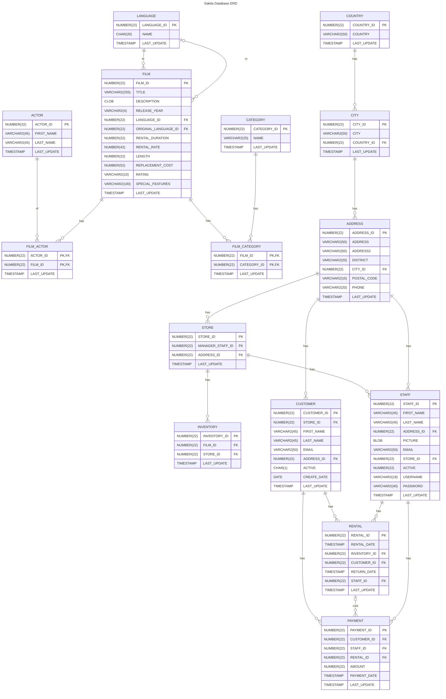

# {{ $frontmatter.title }} 관련

> {{ $frontmatter.description }}

[[toc]]

---

## Sakila Database

[<FontIcon icon="iconfont icon-github"/>`jOOQ/sakila`](https://github.com/jOOQ/sakila) is a nicely normalised database modelling a DVD rental store (for those of you old enough to remember what that is). Its design includes a few nice features:

- Many to many relationships
- Multiple paths between entities (_e.g._ film-inventory-rental-payment vs film-inventory-store-customer-payment) to practice joins
- Consistent naming of columns
  - Primary keys are called `[tablename]_[id]`
  - Foreign keys are called like their referenced primary key, if possible. This allows for using `JOIN .. USING` syntax where supported
  - Relationship tables do not have any surrogate keys but use composite primary keys
  - Every table has a `last_update` audit column
  - A generated data set of a reasonable size is available

### ERD


> For this project, we are going to use the following entities

- `ACTOR`
- `FILM_ACTOR`
- `FILM`

<!-- 

 -->
### Docker

Run the following script

```sh
docker run --platform linux/amd64 \
  -d -it \
  --name sakila \
  --publish 3306:3306 \
  restsql/mysql-sakila:latest
#
# Unable to find image 'restsql/mysql-sakila:latest' locally
# latest: Pulling from restsql/mysql-sakila
# d54efb8db41d: Download complete
# f8b845f45a87: Download complete 
# e8db7bf7c39f: Download complete 
# 9654c40e9079: Download complete 
# 6d9ef359eaaa: Download complete 
# 9fc85a5d43a6: Download complete 
# 095c073d31fa: Download complete 
# 3aba1b8904c8: Download complete 
# 253ef57834ca: Download complete
# b771e54105b2: Download complete
# Digest: sha256:8510e8f1957548d7acb942456f4469bbfd7680da2afdbce0be9819281cc9fd7f
# Status: Downloaded newer image for restsql/mysql-sakila:latest
# 5f73bcc57e2b9514e657a711f3a9234db3f0b44b26763d6bd4347c66c42be647   
```

Verify the container is running healthy

### Intellij Idea CE

Find and attach JDBC Connection

#### Installation

```card
title: Jetbrains Plugin - Database Navigator
desc: Database development, scripting and navigation tool
link: https://plugins.jetbrains.com/plugin/1800-database-navigator
logo: https://plugins.jetbrains.com/files/1800/424452/icon/pluginIcon.svg
color: (10, 10, 10, 0.2)
```

Install [`Database Navigator` Plugin](https://plugins.jetbrains.com/plugin/1800-database-navigator) (if not installed)

::: tabs

@tab:active mac

- <FontIcon icon="iconfont icon-select"/>`[Preferences] > [Plugins]`
- Find `Database Navigator` Plugin and Install 

:::

#### Make Connection

On <FontIcon icon="iconfont icon-select"/>`[DB Browser]` view, 
- Click `[+]` button and select <FontIcon icon="iconfont icon-select"/>`MySQL`
- Type the following information and test connection 

| title | description |
| :--- | :---- |
| `Name` | Sakila |
| `Connection Type` | Database |
| `Host` | localhost |
| `Port` | `3306` | 
| `Database` | `sakila` |
| 🔑`User`/`Password` | `root`/`sakila` |

### Connect Quarkus Application to DB

> File: <FontIcon icon="iconfont icon-folder"/>`src/main/resources/`<FontIcon icon="iconfont icon-file"/>`application.properties`

```properties
# General databse config
quarkus.datasource.jdbc.driver=com.mysql.cj.jdbc.Driver
quarkus.datasource.jdbc.url=jdbc:mysql://localhost:3306/sakila
quarkus.datasource.username=root
quarkus.datasource.password=sakila

# Hibernate config
quarkus.hibernate-orm.log.sql=true
```

---

<TagLinks />