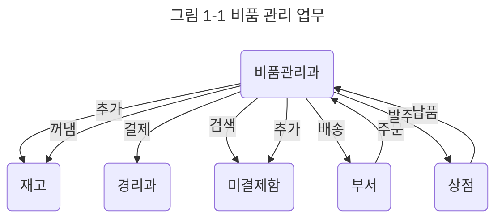

# {{ $frontmatter.title }} 관련

[[toc]]

---

## A. 객체 개념

### 소프트웨러를 기능중심으로 설계했을 때의 문제점

C, 파스칼, 오래된 베이직 같은 프로그래밍 언어는 대부분 '이것을 하고 다음엔 저것을 한다'는 식의 시간 순으로 처리할 내용을 적는 __순차 처리__, 조건 성립에 따라 처리 내용을 선택하는 __분기__, 같은 처리를 몇 번이고 되풀이하는 __반복문__, 이렇게 세 가지 기본 유형을 조합해서 프로그램을 만듭니다. 이런 언어가 __절차형 언어__입니다.

객체지향이 나오기 전에는 소프트웨어 설계에서 프로그램을 체계화된 기능 모음이라고 보고 요구한 사양을 절차나 함수로 구현하는 것을 프로그램 작성이라고 했습니다. 따라서 소프트웨어에 대한 요구에서 구현 가능한 기능을 뽑아내고 사용할 자료 형식을 정해 이것을 조합하는 방법을 생각하는 것이 소프트웨어 설계에서는 큰 관심거리였습니다.

간단한 예로 회사에서 물건을 관리하고 구매하는 업무를 자동화하는 것을 생각해봅시다. 어떤 부서에서 물건 구매를 요청하면 우선 부서에 할당된 예산을 확인하는 작업을 합니다. 기존에는 물건 구매를 요청하면 이미지와 입력용 절차 설계, 사용하는 자료의 형식 정의, 자료가 바르게 들어왔는지 확인하는 함수 정의, 예산 자료 정의와 해당 자료에 접근하는 절차 정의처럼 업무를 절차와 함수로 나누고 필요한 자료의 형식 정의를 하는 방법으로 설계했습니다.

하지만 소프트웨어에 요구하는 기능은 쉴 틈 없이 바뀝니다. 지금까지는 종이 서류로 넘겼던 구매 요청을 웹 기반으로 입력하거나 부서별, 물건별로 구입 이력 일람을 표시하는 기능을 추가하려고만 해도 이전에 설계한 소프트웨어를 많이 변경해야 했습니다. 기능은 소프트웨어에 바라는 본질이므로 상당히 쉽게 바뀔 수 있습니다. 따라서 기능 중심으로 설계한 소프트웨어는 변경에 취약해서 유지 보수하는 데 비용이 많이 듭니다.

### 객체로 모델회

1980년대 후반부터 __객체지향__ (Object-Oriented)이 주목받기 시작했습니다.

우선 컴퓨터에서의 구현 방법은 생각하지 말고 넓은 의미로 살펴보면 __객체__(Object)는 사람이 '물건'으로 서로 구별해서 인식하는 대상을 말합니다. 예를 들어 여러분이 손에 들고 있는 책은 '물건'입니다. 메모장이나 책상, 시계, 오토바이, 자동차, 청구서, 월급 명세, 도서관, 구청 같은 것도 '물건' 입니다.

그리고 객체에는 __속성__(attribute)이 있어서 __메시지__(message)를 받으면 그에 따른 처리를 합니다. 속성이란 자동차라면 몇 명을 태울 수 있는가, 무슨 색인가, 현재 시속 몇 킬로미터로 달리는가와 같은 대상의 성질이나 내부 정보를 말하며, 상태 또는 프로퍼티(property)라고도 부릅니다. 메시지란 객체에서 객체로 보내는 정보 전달로, 어떤 것을 전하거나 문의하거나 처리를 의뢰하는 데 사용합니다.

객체지향은 이런 객체를 사용한 모델을 기반으로 소프트웨어를 분석, 설계, 구현하는 방식입니다.

앞서 봤던 물건 관리와 구매에 적용해봅시다. 비품 관리라는 볼펜이나 복사 용지같은 소모품을 어느 정도 쌓아두고 있습니다. 각 부서에서 요청했을 때 재고가 충분하다면 물품을 바로 넘기고 경리과에 결제를 요청합니다. 재고가 없다면 상점에 물품을 발주하고 부서에서 온 주문 의뢰는 미결제함에 넣어둡니다. 물품이 도착하면 미결제함에서 해당 물품을 주문한 주문서를 꺼내 주문했던 물건을 부서로 보내고 동시에 결제를 경리과로 요청합니다.

<!-- TODO: 이미지 추가 -->

잘 이해가 되지 않을 수 있겠지만 [그림 1-1]을 보면서 다시 읽으면 좀 더 쉽게 이해할 수 있을겁니다. 이 그림에서는 타원이 객체, 화살표가 메시지 송신을 의미합니다. 객체 속성은 안 나왔지만 재고라면 볼펜이나 복사 용지 개수, 미결제함이라면 처리하지 않은 주문이 정보로 쌓여 있습니다. 그리고 주문자체는 '주문 용지' 객체로 표현합니다. 몇 가지 개념 사이의 관계를 정리할 때는 [그림 1-1]처럼 그림을 그려서 생각을 정리하는 게 좋으며, 이것을 그대로 소프트웨어 모델로 사용한다고 생각하면 됩니다.

예를 들어 서무과 객체가 비품 관리 객체에 '볼펜 10개가 필요함'이라는 메시지를 보내면 비품 관리과 객체는 창고에 있는 재고 객체 속성인 '볼펜 재고'를 조사해서 필요하다면 상점 객체에 '볼펜을 발주함'이라는 메시지를 보내는 객체 사이의 관계를 설명할 수 있습니다.

여기에서는 기능이 드러나지 않습니다. 각 부서에서 요구가 웹 기반으로 바뀌거나 발주 이력 확인 기능을 더하더라도 이 그림에 그려진 객체 사이의 관계는 큰 변화가 없습니다. 객체를 사용해 작성한 모델은 사람이 생각하는 개념 사이의 관계를 반영한 것이므로 기능을 변경하더라도 큰 영향을 받지 않습니다.

### 메세지로 통신

메시지는 객체 사이의 통신을 위한 유일한 수단입니다. 처리 의뢰나 문의, 응답, 이상 상태 알림 등 모든 정보, 제어 처리는 메시지 송신으로 이루어집니다.

객체는 메시지를 받으면 메시지 내용에 따라 처리를 하고 결과값을 돌려줍니다. 메시지 처리 방법은 그 객체 자체가 안다고 보고 처리 방법에 대한 지식을 __메서드__ (method)나 절차라고 부릅니다. 메서드는 프로그램에서 보통 절차나 규칙 등을 적는 것입니다.

메시지에는 인수로 객체(또는 값)가 따라갑니다. 또한 메시지 처리 결과로 함수 같은 객체(또는 값)를 돌려줄 수도 있습니다.

메시지를 보내는 객체가 __센더__(sender: 송신자), 받는 객체가 __리시버__(receiver: 수신자) 입니다.

객체는 서로 메시지를 주고받는 것으로 협력하고 모두가 모여 하나의 시스템으로서 동작하는데, 이것이 객체를 사용한 실행 모델입니다.

### 모델의 추상화

지금까지 내용을 정리해봅시다. 객체란 다음 목록과 같은 성질을 가진 '물건'이라고 할 수 있습니다.

- 사람이 '물건'으로 다른 것과 구별해서 인식할 수 있음
- 속성이 있음
- 다른 객체에 메시지를 보낼 수 있음
- 메시지를 받아 그에 따라 처리를 함
- 메시지 처리는 객체의 메서드로 이루어짐

이렇게 처리하려는 댕상을 객체 개념으로 모델화하는 방법을 객체지향이라고 합니다. 객체 개념으로 어떤 소프트웨어를 만들까 분석하는 것을 '__객체지향 분석__(OOA: Object-Oriented Analysis)'이라고 합니다. 소프트웨어를 객체 집합이라고 생각해서 모듈 구성을 정하고 소프트웨어 설계를 하면 '__객체지향 설계__(OOD: Object-Oriented Design)'라 하고 객체지향 개념을 프로그래밍 단계에서 사용하면 '__객체지향 프로그래밍__(OOP: Object-Oriented Programming)'이라 합니다. 또한 마우스, 키보드, 화면에 표시되는 버튼 같은 부품과 프로그램 관계를 객체 사이의 메시지 통신으로 생각해서 구성한 인터페이스를 '객체지향 인터페이스'라 합니다.

객체지향 언어라고 하는 프로그래밍 언어를 사용하면 요구 분석과 설계 단계에서 사용한 것과 같은 객체 모델을 바탕으로 프로그래밍이 가능합니다. 기능을 함수로 분해해서 구현하는 예전 방식은 어떤 함수가 요구 분석의 어떤 기능에 대응하는지 대응 관계가 명확하지 않았지만 객체지향에서는 요구 분석, 설계, 프로그래밍에서 사용하는 모델에 일관성이 있어서 상호 관계를 이해하기 쉽고 변경이나 확장이 용이하다는 장점이 있습니다.

<!-- 그림 1-2 추가 (p.33) -->

### 객체 속성

### 클래스

---

## B. 모듈과 객체

### 소프트웨어 모듈

### 독립성 높은 모듈

### 모듈 정보 은폐

### 클래스 정의와 인터페이스

### 메시지 송신 구현

---

<TagLinks />