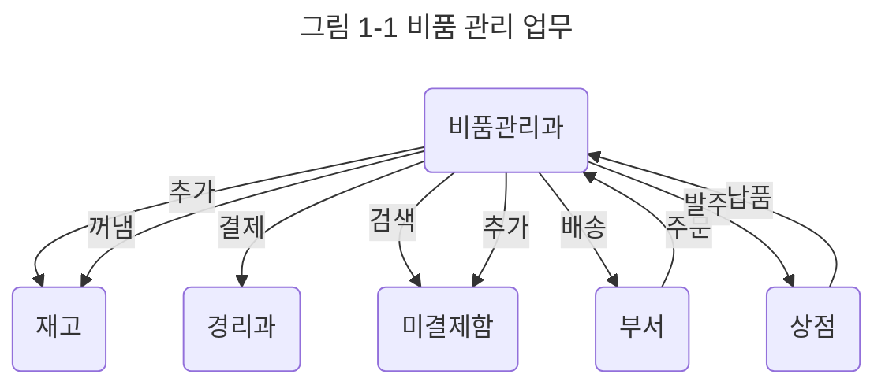

# {{ $frontmatter.title }} 관련

<SiteInfo
  name="목차"
  desc="OSX 구조를 이해하면서 배우는 Objective-C"
  url="/swift/shuokai-objc/README.md"
  preview="https://image.aladin.co.kr/product/2806/68/cover500/8968480338_1.jpg"/>

[[toc]]

---

## 소프트웨러를 기능중심으로 설계했을 때의 문제점

C, 파스칼, 오래된 베이직 같은 프로그래밍 언어는 대부분 '이것을 하고 다음엔 저것을 한다'는 식의 시간 순으로 처리할 내용을 적는 **순차 처리**, 조건 성립에 따라 처리 내용을 선택하는 **분기**, 같은 처리를 몇 번이고 되풀이하는 **반복문**, 이렇게 세 가지 기본 유형을 조합해서 프로그램을 만듭니다. 이런 언어가 **절차형 언어**입니다.

객체지향이 나오기 전에는 소프트웨어 설계에서 프로그램을 체계화된 기능 모음이라고 보고 요구한 사양을 절차나 함수로 구현하는 것을 프로그램 작성이라고 했습니다. 따라서 소프트웨어에 대한 요구에서 구현 가능한 기능을 뽑아내고 사용할 자료 형식을 정해 이것을 조합하는 방법을 생각하는 것이 소프트웨어 설계에서는 큰 관심거리였습니다.

간단한 예로 회사에서 물건을 관리하고 구매하는 업무를 자동화하는 것을 생각해봅시다. 어떤 부서에서 물건 구매를 요청하면 우선 부서에 할당된 예산을 확인하는 작업을 합니다. 기존에는 물건 구매를 요청하면 이미지와 입력용 절차 설계, 사용하는 자료의 형식 정의, 자료가 바르게 들어왔는지 확인하는 함수 정의, 예산 자료 정의와 해당 자료에 접근하는 절차 정의처럼 업무를 절차와 함수로 나누고 필요한 자료의 형식 정의를 하는 방법으로 설계했습니다.

하지만 소프트웨어에 요구하는 기능은 쉴 틈 없이 바뀝니다. 지금까지는 종이 서류로 넘겼던 구매 요청을 웹 기반으로 입력하거나 부서별, 물건별로 구입 이력 일람을 표시하는 기능을 추가하려고만 해도 이전에 설계한 소프트웨어를 많이 변경해야 했습니다. 기능은 소프트웨어에 바라는 본질이므로 상당히 쉽게 바뀔 수 있습니다. 따라서 기능 중심으로 설계한 소프트웨어는 변경에 취약해서 유지 보수하는 데 비용이 많이 듭니다.

---

## 객체로 모델회

1980년대 후반부터 **객체지향** (Object-Oriented)이 주목받기 시작했습니다.

우선 컴퓨터에서의 구현 방법은 생각하지 말고 넓은 의미로 살펴보면 **객체**(Object)는 사람이 '물건'으로 서로 구별해서 인식하는 대상을 말합니다. 예를 들어 여러분이 손에 들고 있는 책은 '물건'입니다. 메모장이나 책상, 시계, 오토바이, 자동차, 청구서, 월급 명세, 도서관, 구청 같은 것도 '물건' 입니다.

그리고 객체에는 **속성**(attribute)이 있어서 **메시지**(message)를 받으면 그에 따른 처리를 합니다. 속성이란 자동차라면 몇 명을 태울 수 있는가, 무슨 색인가, 현재 시속 몇 킬로미터로 달리는가와 같은 대상의 성질이나 내부 정보를 말하며, 상태 또는 프로퍼티(property)라고도 부릅니다. 메시지란 객체에서 객체로 보내는 정보 전달로, 어떤 것을 전하거나 문의하거나 처리를 의뢰하는 데 사용합니다.

객체지향은 이런 객체를 사용한 모델을 기반으로 소프트웨어를 분석, 설계, 구현하는 방식입니다.

앞서 봤던 물건 관리와 구매에 적용해봅시다. 비품 관리라는 볼펜이나 복사 용지같은 소모품을 어느 정도 쌓아두고 있습니다. 각 부서에서 요청했을 때 재고가 충분하다면 물품을 바로 넘기고 경리과에 결제를 요청합니다. 재고가 없다면 상점에 물품을 발주하고 부서에서 온 주문 의뢰는 미결제함에 넣어둡니다. 물품이 도착하면 미결제함에서 해당 물품을 주문한 주문서를 꺼내 주문했던 물건을 부서로 보내고 동시에 결제를 경리과로 요청합니다.

<!-- TODO: 이미지 추가 -->

잘 이해가 되지 않을 수 있겠지만 [그림 1-1]을 보면서 다시 읽으면 좀 더 쉽게 이해할 수 있을겁니다. 이 그림에서는 타원이 객체, 화살표가 메시지 송신을 의미합니다. 객체 속성은 안 나왔지만 재고라면 볼펜이나 복사 용지 개수, 미결제함이라면 처리하지 않은 주문이 정보로 쌓여 있습니다. 그리고 주문자체는 '주문 용지' 객체로 표현합니다. 몇 가지 개념 사이의 관계를 정리할 때는 [그림 1-1]처럼 그림을 그려서 생각을 정리하는 게 좋으며, 이것을 그대로 소프트웨어 모델로 사용한다고 생각하면 됩니다.

예를 들어 서무과 객체가 비품 관리 객체에 '볼펜 10개가 필요함'이라는 메시지를 보내면 비품 관리과 객체는 창고에 있는 재고 객체 속성인 '볼펜 재고'를 조사해서 필요하다면 상점 객체에 '볼펜을 발주함'이라는 메시지를 보내는 객체 사이의 관계를 설명할 수 있습니다.

여기에서는 기능이 드러나지 않습니다. 각 부서에서 요구가 웹 기반으로 바뀌거나 발주 이력 확인 기능을 더하더라도 이 그림에 그려진 객체 사이의 관계는 큰 변화가 없습니다. 객체를 사용해 작성한 모델은 사람이 생각하는 개념 사이의 관계를 반영한 것이므로 기능을 변경하더라도 큰 영향을 받지 않습니다.

---

## 메세지로 통신

메시지는 객체 사이의 통신을 위한 유일한 수단입니다. 처리 의뢰나 문의, 응답, 이상 상태 알림 등 모든 정보, 제어 처리는 메시지 송신으로 이루어집니다.

객체는 메시지를 받으면 메시지 내용에 따라 처리를 하고 결과값을 돌려줍니다. 메시지 처리 방법은 그 객체 자체가 안다고 보고 처리 방법에 대한 지식을 **메서드** (method)나 절차라고 부릅니다. 메서드는 프로그램에서 보통 절차나 규칙 등을 적는 것입니다.

메시지에는 인수로 객체(또는 값)가 따라갑니다. 또한 메시지 처리 결과로 함수 같은 객체(또는 값)를 돌려줄 수도 있습니다.

메시지를 보내는 객체가 **센더**(sender: 송신자), 받는 객체가 **리시버**(receiver: 수신자) 입니다.

객체는 서로 메시지를 주고받는 것으로 협력하고 모두가 모여 하나의 시스템으로서 동작하는데, 이것이 객체를 사용한 실행 모델입니다.

---

## 모델의 추상화

지금까지 내용을 정리해봅시다. 객체란 다음 목록과 같은 성질을 가진 '물건'이라고 할 수 있습니다.

- 사람이 '물건'으로 다른 것과 구별해서 인식할 수 있음
- 속성이 있음
- 다른 객체에 메시지를 보낼 수 있음
- 메시지를 받아 그에 따라 처리를 함
- 메시지 처리는 객체의 메서드로 이루어짐

이렇게 처리하려는 댕상을 객체 개념으로 모델화하는 방법을 객체지향이라고 합니다. 객체 개념으로 어떤 소프트웨어를 만들까 분석하는 것을 '**객체지향 분석**(OOA: Object-Oriented Analysis)'이라고 합니다. 소프트웨어를 객체 집합이라고 생각해서 모듈 구성을 정하고 소프트웨어 설계를 하면 '**객체지향 설계**(OOD: Object-Oriented Design)'라 하고 객체지향 개념을 프로그래밍 단계에서 사용하면 '**객체지향 프로그래밍**(OOP: Object-Oriented Programming)'이라 합니다. 또한 마우스, 키보드, 화면에 표시되는 버튼 같은 부품과 프로그램 관계를 객체 사이의 메시지 통신으로 생각해서 구성한 인터페이스를 '객체지향 인터페이스'라 합니다.

객체지향 언어라고 하는 프로그래밍 언어를 사용하면 요구 분석과 설계 단계에서 사용한 것과 같은 객체 모델을 바탕으로 프로그래밍이 가능합니다. 기능을 함수로 분해해서 구현하는 예전 방식은 어떤 함수가 요구 분석의 어떤 기능에 대응하는지 대응 관계가 명확하지 않았지만 객체지향에서는 요구 분석, 설계, 프로그래밍에서 사용하는 모델에 일관성이 있어서 상호 관계를 이해하기 쉽고 변경이나 확장이 용이하다는 장점이 있습니다.

<!-- 그림 1-2 추가 (p.33) -->

어떤 '물건'을 객체로 가정했을 때 현실에서 그 '물건'이 가진 여러 성질이나 동작, 자세한 구성을 모델에 반영하지 않아도 됩니다. 속성과 동작, 다른 객체와의 관계는 지금부터 작성하려는 모델에 필요하다고 생각하는 것만 준비하면 됩니다. 물론 실제 비품 관리 업무는 앞에서 본 예처럼 단순하지 않습니다. 하지만 발주 용지 크기는 A4고 접수 시간을 오전 9시에 서 오후 5시까지라는 등의 불필요한 정보가 있다면 버리고 단순화하면 됩니다.

이렇듯 지금까지 살펴본 문제에서 관계없는 정보를 빼고 대상의 본질만 추려내는 것을 **추상화**(abstraction)라고 부릅니다. 현실의 '물건'은 자세히 관찰하고 붆석할수록 다양한 부분과 측면이 보입니다. 하지만 복잡한 대상도 추상화하면 간단한 개념 집합으로 설명할 수 있으며, 이 과정은 무척 중요합니다.

객체의 정보를 어떻게 취사 선택해서 추상화할 것인가는 만들려는 모델이나 소프트웨어의 내용과 성질에 따라 달라집니다. 하지만 사람은 대상을 인식할 때 의식하지 못하는 사이에 추상화를 합니다. 모델화에 따른 객체 인식도 사람이 평소에 하는 인식과 비슷하다고 볼 수 있습니다.

지믁까지의 설명으로 보면 어떤 것도 객체로 다룰 수 있을 것 같다는 생각이 들 것입니다. 그렇다면 객체로 다루어야 할 것, 객체로 다루기엔 적합하지 않는 것을 구별할 수 있을까요?

사실 완벽히 구별할 수는 없습니다. 객체를 사용해 무언가를 모델화할 때 모델이 적당하면 아무런 문제가 없지만 단, 객체로 보기에 쉽거나 어렵다는 차이는 있습니다. 현실에서도 물리적으로 독립해서 있는 것, 전체를 구성하는 부품, 어떤 역할을 하는 사람이나 부서 등은 객체로 보기 쉽습니다. 특히 의인화할 수 있다면 객체화하기가 더 쉽습니다. 또한 복소수나 행렬 같은 수치 조작 대상이 되는 '것'도 객체로 다룰 수 있습니다.

반대로 시간, 공간, 물리학에서 이야기하는 '장()'처럼 넓은 범위를 가진 것, '학문', '논리', '감동'처럼 실체가 없이 물리적, 수학적 조작에 어울리지 않는 것은 객체로 보기 어렵습니다. '메시지에 반응해 처리하는 것'이라는 방식으로 설명하기 힘든, 이런 대상은 보통 객체로 다루지 않습니다.

그럼 '숫자'는 객체일까요? 아닐까요? 두 가지 의견이 있습니다. 정수나 실수처럼 구조가 없는, 달리 말하면 '기본적인'자료형도 객체로 보는 의견과 객체로 보지 않는 의견입니다. 프로그래밍 언어로 말하자면 객체지향 언어의 원조적인 스몰톡(Smalltalk)은 숫자는 물론 모든 것을 객체로 봅니다. 한편, <FontIcon icon="iconfont icon-cpp"/>C++에서는 숫자는 객체가 아닙니다. <FontIcon icon="iconfont icon-objective-c"/>Objective-C에서도 기본적으로 숫자는 객체로 보지 않습니다. 이 문제는 다른 장에서 설명하겠습니다.

::: info 칼럼 1 - 미주알고주알 '객체지향'

객체지향은 널리 사용되지만 객체지향에 관련된 다양한 용어는 공통된 정의나 인식이 없으므로 주의해서 사용해야 합니다. 예를 들어 프로그래밍 언어가 어떤 조건을 만족하면 '객체지향 언어'라고 부른다라는 것조차도 다양한 의견이 있습니다.

이렇듯 기본 정의, 개념, 호ㅇ칭까지도 프로그래밍 언어나 설계 기법 등 입장에 따라 서로 달라서 때로는 재념 정의에 혼란이 생길 정도로 복잡합니다. 더욱이 번역 과정에서 서로 다른 용어로 번역하기도 해서 더 복잡합니다. <FontIcon icon="iconfont icon-objective-c"/>Objective-C는 객체지향의 원조격인 스몰톡의 객체지향 방식을 따르므로 개념이나 용어가 스몰톡과 거의 같습니다. 예를 들어 <FontIcon icon="iconfont icon-cpp"/>C++에서 보는 객체와 <FontIcon icon="iconfont icon-objective-c"/>Objective-C에서 보는 객체는 닮은 듯하면서도 상당히 다른 부분도 있습니다. 다른 객체지향 언어를 배운 분이라면 그 차이를 생각하며 이 책을 읽기 바랍니다.

:::

---

## 객체 속성

객체 개념에서 속성을 나타내는 방법을 조금 더 설명하겠습니다. [그림 1-3]은 속성과 메서드가 있는 객체를 개념적으로 그린 것입니다.

<!-- 그램 1-3: 객체 개념도 -->

객체는 속성, 즉 상태가 있다고 했지만 속성은 어떤 걸 나타내는 것일까요? 객체는 다른 객체를 참조해서 속성을 나타냅니다. 속성을 나타내는 다른 객체의 참조(포인터)를 저장한 장소가 **인스턴스 변수**(instance variable, 약어로 ivar)입니다. 또는 그냥 변수라고도 하며, 변수에서 참조할 수 있는 객체가 없는 상태를 '널(null)'로 표현하기도 합니다. 게다가 숫자 같은 데이터도 객체 상태를 표현하기 위해 변수에 저장할 수 있습니다.

<!-- 그림 1-4: 객체 속성 -->

[그림 1-4]는 간단한 예로, 이것은 물이나 기름이 든 탱크의 온도 유지 장치라고 생각합시다. 그림 왼쪽 위의 객체는 장치의 전체 동작을 제어하며 스위치, 온도 조절 장치, 현재 어떤 동작을 하는가 (정지, 저온 보온, 고온 보온 등)를 나타내는 동작 모드를 속성으로 가집니다. 스위치와 온도 조절 장치 속성을 나타내는 변수에서는 다른 객체를 참조합니다.

온도 조절 장치 객체에는 속성이 몇 가지 더 있습니다. 수온 조사 센서 변수, 수온이 낮아질 때 열을 내는 히터 변수, 현재 수온 표시 장치 변수는 다른 객체를 참조합니다. 경보 장치는 수온이 과열되는 등의 경우에 경보를ㄹ 울리는 장치지만 여기에서는 어무것도 참조하지 않습니다. 또한 최고 온도, 최저 온도에는 숫자가 들어 있습니다.

객체와 객체를 연결하려면 이처럼 어떤 객체 변수에서 다른 객체를 참조해야 합니다. 참조가 안 된 객체에는 메시지를 보낼 수 없습니다. <FontIcon icon="iconfont icon-objective-c"/>Objective-C에서는 다른 객체를 참조하기 위한 변수를 **아울렛**(outlut)이라고 부르는데, 특히 GUI 구조 도구인 인터페이스 빌더 (Interface Builder)에서 이 용어를 사용합니다. 객체끼리 플래그 같은 걸로 연결해서 사용한다는 느낌으로 생각하면 됩니다.

---

## 클래스

[그림 1-4]는 탱크의 온도 관리를 하는 여러 객체들의 관계를 나타냈습니다. 하지만 큰 공장에서는 이렇게 온도를 관리해야 하는 탱크가 수십, 수백 개 있을 겁니다. 그럴 때 각각의 탱크나 반응용기마다 객체를 정의하는 건 힘든 일입니다.

따라서 같은 변수 및 메서드를 가진 객체 '틀'을 준비해두고 각각의 객체는 이것을 바탕으로 만들면 편하겠죠. 이런 객체를 만드는 틀을 **클래스**(class)라고 부릅니다.

클래스는 개별적인 객체가 가진 정보나 지식의 공통점을 합쳐둔 것으로, 예를 들어 자동차는 다양하지만 기본 기능이나 운전 방법은 같습니다. 개별적인 자동차 구조나 운전 방법 같은 자세한 내용은 생략하고 추상화해서 '자동차'라는 개념으로 구조나 운전 방법을 이야기할 수 있는데, 이렇게 자동차를 추상화한 개념이 클래스에 해당합니다. 개별 객체는 각각 다른 부분도 있지만 이런 공통부분을 하나의 개념으로 다루면 클래스가 만들어집니다.

클래스는 이런 클래스에 포함된 객체 공통의 변수나 베서드를 정의합니다. 각 객체의 차이는 그런 변수에 어떤 값이 들어가는지에 따라 정해집니다. 자동차라면 색, 모양, 엔진, 타이어 같은 변수가 있으며, 지정된 값에 따라 서로 다른 자동차가 만들어집니다.

객체 틀인 클래서에서 구체적인 객체를 만드는 것이 **구체화** 또는 **인스턴스화**(instantiation)입니다. 그리고 클래서에서 구체화해서 만든 객체를 **인스턴스 객체**(instance object) 또는 간단히 **인스턴스** 라고 합니다.

인스턴스에는 저마다 변수가 있고 변수에는 서로 다른 객체를 참조하는 등 다양한 값이 들어 있습니다. 그래서 인스턴스가 가진 변수를 인스턴스 변수라고 합니다. 인스턴스 변수 정의는 클래스에 모여 있지만 인스턴스 객체마다 서로 다른 값을 인스턴스 변수에 저장할 수 있습니다. 인스턴스 객체는 클래스에서 작성한 메서드 정의를 공유하며, 인스턴스마다 메서드를 정의하지 않습니다.

<!-- [그림 1-5]: 객체와 인스턴스 예 -->

[그림 1-5]는 수온을 관리하는 객체와 기름 온도를 관리하는 객체를 같은 클래스로 구체화한 예입니다. 수온과 기름 온도의 관리 방법, 즉 메서드는 기본적으로 같지만 인스턴스 변수 내용은 다릅니다. 물과 기름의 최고 온도, 최저 온도는 다르고 센서나 히터는 각각 다른 객체를 참조합니다. 객체지향 언어 대부분은 객체를 반드시 클래스 정의에서 인스턴스화해서 만들도록 정해져 있습니다.

클래스에는 무척 중요한 '**상속**' 기능이 잇지만 한 번에 많이 설명하면 머리가 복잡해지므로 이번 장에서는 여기까지 설명하겠습니다. 상속은 '[3장](03.md)'에서 자세히 설명하고 여기에서는 소프트웨어 구성 부품이라는 측면에서 객체를 설명하겠습니다.

::: info 칼럼 2 - Cocoa와 Objective-C 역사

Mac OS X는 애플 사 창업자인 스티브 잡스가 세운 NeXT 사에서 만든 객체지향 기술을 사용합니다. 1988년 NeXT 사에서 개발한 넥스트 컴퓨터는 유닉스 기반으로 메킨토시보다 앞선 GUI 환경을 구현했습니다. 당시 윈도우는 장남감 수준에 불과했습니다. 넥스트 컴퓨터의 기본 소프트웨어인 NEXTSTEP(이후 멀티 플랫폼화해서 OPENSTEP으로 이름이 바뀜) 개발언어가 <FontIcon icon="iconfont icon-objective-c"/>Objective-C였습니다. 그리고 Mac OS X에서 애플리케이션 소프트웨어가 동작하는 기반이 Cocoa API인데, 이 API는 OPENSTEP의 중요한 API를 계승해 발전시킨 것입니다. Cocoa API에서 쓰는 'NS'라는 접두어는 NEXTSTEP을 의미합니다.

객체지향 언어 시스템으로 쓸모있는 프로그램을 개발하려면 표준 API를 이해해야만 합니다. Cocoa는 프레임워크로 다양한 클래스를 제공하는데, 여기에는 객체지향 개발에 있어 필수적인 개념이 충실하게 들어 있습니다. 한동안 Cocoa 환경에서 소프트웨러를 개발하다 보면 이런 프레임워크의 철학이나 프레임워크를 구축한 기술자의 깊은 통찰력을 느끼게 되어 감탄할 것입니다.

2006년에 애플 사는 Mac 프로세서를 PowerPC에서 인텔 사 제품으로 변경했습니다. 칩셋을 바꿧지만 본래 멀티 플랫폼(인텔, 모토로라, Sun, HP)에 대응할 수 있게 OPENSTEP을 만들었기에 Mac OS X소프트웨러를 거의 수정하지 않고도 컴파일만 다시 하면 인텔 사 칩셋에서 동작했습니다. 이런 OPENSTEP을 계승한 Cocoa API가 이식성이 높은 것은 당연합니다.

또한 애플 사는 2007년에 아이폰, 2010년에 아이패드를 발표했습니다. 이 기기들의 OS인 iOS(당시에는 아이폰 OS라고 불렀습니다)는 Mac OS X을 휴대 단말기용으로 만든 것으로, 애플리케이션 개발 프레임워크는 Cocoa Touch였습니다. 프로그래밍 언어는 <FontIcon icon="iconfont icon-objective-c"/>Objective-C이며, 이는 <FontIcon icon="iconfont icon-c"/>C 언어 상위 호환 언어이므로 객체지향을 바탕으로 한 유연한 설계와 하드웨어 성능을 향상시키는 프로그래밍을 별 무리 없이 병행할 수 있습니다.

앞으로도 애플 사는 새로운 기기나 시스템을 개발할 때마다 Mac OS X 기술을 사용함은 물론이고 동시에 <FontIcon icon="iconfont icon-objective-c"/>Objective-C를 애플리케이션 작성 언어로 채용할 거라고 예상됩니다.

:::

---

<TagLinks />